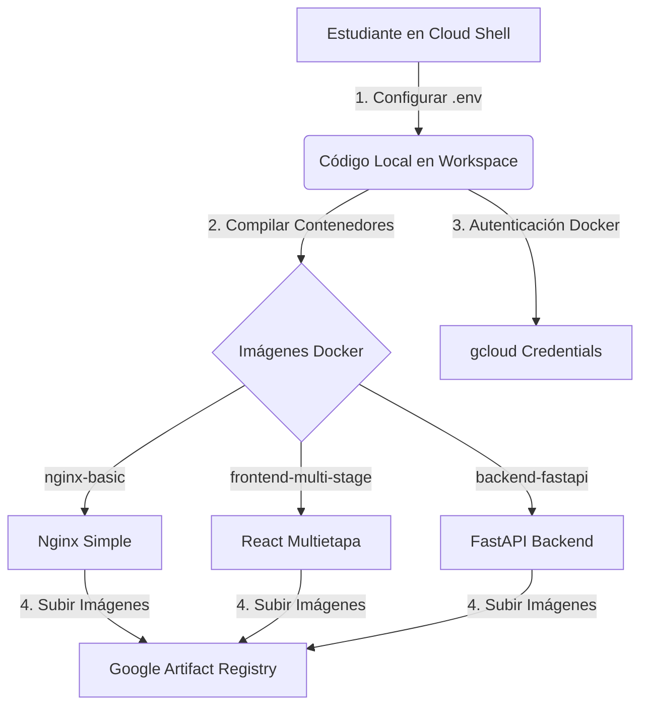

# Guía de Introducción Práctica a GCP: Contenedores y Registro de Artifacts 🚀

Esta guía interactiva y práctica está diseñada para estudiantes de sistemas de nivel universitario intermedio. Su objetivo es aprender los conceptos de **Docker**, **Compilaciones Multietapa (Multi-Stage Builds)**, y cómo interactuar con **Google Cloud Platform (GCP)** para almacenar imágenes de contenedores de manera segura en **Google Artifact Registry**.

---

## 🏗️ Estructura del Proyecto

El repositorio está organizado con los siguientes componentes principales:
*   [gcp-class/.env.example](file:///home/zombyegru/gcp-class/.env.example): Archivo de plantilla para configurar tus variables locales.
*   [gcp-class/nginx-basic/Dockerfile](file:///home/zombyegru/gcp-class/nginx-basic/Dockerfile): Demostración de un contenedor web estático básico usando Nginx.
*   [gcp-class/frontend-multi-stage/Dockerfile](file:///home/zombyegru/gcp-class/frontend-multi-stage/Dockerfile): Frontend en React + Vite compilado usando compilación multietapa.
*   [gcp-class/backend-fastapi/Dockerfile](file:///home/zombyegru/gcp-class/backend-fastapi/Dockerfile): API Backend desarrollada con FastAPI y Python.
*   [gcp-class/.gitignore](file:///home/zombyegru/gcp-class/.gitignore): Configuración para excluir archivos locales del control de versiones.

---

## 📊 Arquitectura del Flujo de Trabajo

El siguiente diagrama muestra el ciclo de vida completo de esta práctica: desde la clonación del repositorio local hasta el push a la nube de GCP.



---

## 1. ⚙️ Dependencias y Prerrequisitos

Antes de comenzar, asegúrate de cumplir con los siguientes requisitos en el entorno de desarrollo.

### A. Cuenta y Proyecto de GCP
1.  **Acceso al Proyecto**: Asegúrate de tener una invitación activa a un proyecto de GCP existente o crea un proyecto nuevo desde la [Consola de Google Cloud](https://console.cloud.google.com).
2.  **Verificación desde la Consola**: Ve a la consola web y asegúrate de que el proyecto está seleccionado en el panel superior.
3.  **Listar Proyectos vía CLI**:
    Puedes verificar el proyecto configurado actualmente en tu terminal con:
    ```bash
    gcloud config list project
    ```
    O ver todos tus proyectos asociados con:
    ```bash
    gcloud projects list
    ```

### B. Herramientas CLI preinstaladas en Cloud Shell
Dado que estamos utilizando **Google Cloud Shell**, las siguientes herramientas clave ya vienen preinstaladas y configuradas:

*   **Docker**: Motor para construir y ejecutar contenedores.
*   **Git**: Sistema de control de versiones.
*   **CLI de GCP (`gcloud`)**: Herramienta de comandos para gestionar recursos de GCP.
*   **Herramienta para Cloud Storage (`gsutil` / `gcloud storage`)**:
    *   *Comando clásico*: `gsutil ls` (Lista los buckets y objetos del proyecto).
    *   *Comando moderno (actualizado)*: 
        ```bash
        gcloud storage ls
        ```
*   **Herramienta para BigQuery (`bq`)**: Herramienta de línea de comandos para consultar y administrar datasets. Puedes ver su estado inicial con:
    ```bash
    bq ls
    ```

---

## 2. 👥 Configuración Inicial y Repositorio Git

El flujo inicia configurando el repositorio git y las variables de entorno de tu máquina local/Cloud Shell.

### A. Clonar el repositorio
El estudiante clonará este repositorio en su entorno de trabajo local:
```bash
git clone <URL_DEL_REPOSITORIO_REMOTO> gcp-class
cd gcp-class
```

### B. Crear y Configurar el Archivo `.env`
Copia la plantilla de variables de entorno y complétala con tus datos específicos del proyecto de GCP y tus datos de estudiante:
```bash
cp .env.example .env
```
Abre el archivo `.env` recién creado y configúralo según tu entorno:
*   `GCP_PROJECT_ID`: ID del proyecto que vas a utilizar en GCP.
*   `GCP_REGION`: Región geográfica donde crearás el Artifact Registry (por ejemplo, `us-central1`).
*   `GCP_ARTIFACT_REPO`: Nombre del repositorio de Artifact Registry (por ejemplo, `gcp-class-repo`).

### C. Configurar Git con tus Datos
Para que tus commits queden registrados correctamente:
```bash
# Carga las variables de entorno configuradas
export $(cat .env | xargs)

# Aplica la configuración local de git
git config --local user.name "$GIT_USER_NAME"
git config --local user.email "$GIT_USER_EMAIL"
```

---

## 3. 🐳 Inspección y Análisis de Dockerfiles

Veamos en detalle los tres tipos de arquitecturas de contenedores que utilizaremos.

### Módulo A: Servidor Web Estático Básico (Nginx)
*   **Ubicación**: [nginx-basic/Dockerfile](file:///home/zombyegru/gcp-class/nginx-basic/Dockerfile)
*   **Concepto**: Es el uso estándar de Docker. Tomamos una imagen existente de un servidor web listo para producción, sobreescribimos su archivo estático básico de inicio y exponemos el puerto HTTP (80).

### Módulo B: Frontend Multietapa (React + Vite)
*   **Ubicación**: [frontend-multi-stage/Dockerfile](file:///home/zombyegru/gcp-class/frontend-multi-stage/Dockerfile)
*   **Concepto**: Las compilaciones multietapa (Multi-Stage Builds) nos permiten dividir el `Dockerfile` en secciones independientes para optimizar el tamaño de la imagen final.

```mermaid
graph TD
    subgraph Etapa 1: Compilador (Node.js)
        A[Instalar Dependencias de Desarrollo] --> B[Compilar React/Vite con npm run build]
        B --> C[Resultado: Archivos HTML/JS/CSS estáticos en /dist]
    end
    
    subgraph Etapa 2: Servidor (Nginx Alpine)
        D[Servidor web básico y liviano] --> E[Copiar archivos de /dist al servidor]
    end

    C -->|Copiar solo lo necesario| E
```

> [!TIP]
> **¿Por qué usar Multi-Stage?** Evitamos meter herramientas pesadas como Node.js, `npm`, o carpetas enormes como `node_modules` en la imagen que se envía a producción. Esto reduce drásticamente el tamaño (de ~500MB a menos de 30MB) y mitiga vulnerabilidades de seguridad.

### Módulo C: Backend con Código Local (FastAPI + Python)
*   **Ubicación**: [backend-fastapi/Dockerfile](file:///home/zombyegru/gcp-class/backend-fastapi/Dockerfile)
*   **Concepto**: Levantamos un servidor web backend dinámico usando Python, FastAPI y Uvicorn. Copiamos el archivo de dependencias `requirements.txt` e instalamos las librerías necesarias de forma óptima, exponiendo la API en el puerto `8000`.

---

## 4. 🚀 Compilación y Push a Google Artifact Registry

Una vez comprendido el código, es hora de construir nuestras imágenes y subirlas a la nube de GCP.

### Paso 1: Habilitar la API de Artifact Registry en GCP
Para que nuestro proyecto de GCP pueda almacenar las imágenes, debemos asegurarnos de tener la API activa:
```bash
# Carga las variables nuevamente por seguridad
export $(cat .env | xargs)

# Habilita el servicio de Artifact Registry en el proyecto
gcloud services enable artifactregistry.googleapis.com --project="$GCP_PROJECT_ID"
```

### Paso 2: Crear el Repositorio de Contenedores en GCP
Crea un repositorio de formato Docker en la región de tu preferencia:
```bash
gcloud artifacts repositories create "$GCP_ARTIFACT_REPO" \
    --repository-format=docker \
    --location="$GCP_REGION" \
    --description="Repositorio de contenedores de clase de GCP" \
    --project="$GCP_PROJECT_ID"
```

### Paso 3: Configurar Autenticación de Docker
Permite que el cliente local de Docker se autentique automáticamente contra la nube de Google Cloud para subir las imágenes:
```bash
gcloud auth configure-docker "$GCP_REGION-docker.pkg.dev"
```
*(Confirma con `y` si solicita la modificación en los archivos de configuración local de Docker)*

### Paso 4: Construir y Etiquetar las Imágenes
La nomenclatura obligatoria para etiquetar imágenes en Artifact Registry es:
`REGIONAL-docker.pkg.dev/PROJECT_ID/REPOSITORY_NAME/IMAGE_NAME:TAG`

Ejecutemos la compilación de cada módulo:

```bash
# Definimos el prefijo común para Artifact Registry
REGISTRY_PATH="$GCP_REGION-docker.pkg.dev/$GCP_PROJECT_ID/$GCP_ARTIFACT_REPO"

# 1. Compilar nginx-basic
docker build -t "$REGISTRY_PATH/nginx-basic:v1" ./nginx-basic

# 2. Compilar frontend-multi-stage (React)
docker build -t "$REGISTRY_PATH/frontend-multi-stage:v1" ./frontend-multi-stage

# 3. Compilar backend-fastapi (Python)
docker build -t "$REGISTRY_PATH/backend-fastapi:v1" ./backend-fastapi
```

### Paso 5: Listar Imágenes Locales
Puedes verificar que tus imágenes se construyeron y etiquetaron correctamente:
```bash
docker images
```

### Paso 6: Hacer Push de las Imágenes a GCP
Sube las imágenes construidas al Artifact Registry de Google Cloud:
```bash
docker push "$REGISTRY_PATH/nginx-basic:v1"
docker push "$REGISTRY_PATH/frontend-multi-stage:v1"
docker push "$REGISTRY_PATH/backend-fastapi:v1"
```

¡Excelente! Al ingresar a la consola web de GCP y navegar a **Artifact Registry**, verás tus tres imágenes de contenedor cargadas con la etiqueta `:v1` listas para ser desplegadas en servicios como Cloud Run o GKE.
