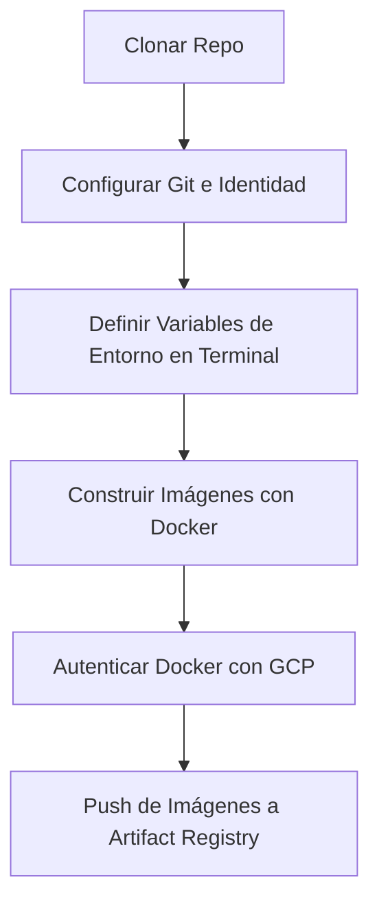

# ¡Hola, Ingeniero/a GCP! 👋

¡Te damos la bienvenida a tu guía práctica sobre contenedores y despliegues en la nube! En esta aventura vas a aprender conceptos fundamentales sobre **Docker**, compilaciones optimizadas multietapa (**Multi-Stage builds**), y cómo interactuar de forma manual y directa con los servicios de **Google Cloud Platform (GCP)** para almacenar imágenes listas para producción en **Google Artifact Registry**.

A lo largo de este laboratorio, recorreremos el siguiente temario:

1.  **Configuración del Entorno**: Preparación de herramientas y configuración de tu identidad de Git.
2.  **Análisis de los Contenedores**: Inspección y entendimiento del código de tres tipos diferentes de Dockerfiles.
3.  **Compilación y Etiquetado Manual**: Construcción local de imágenes Docker paso a paso.
4.  **Autenticación y Subida a GCP**: Configuración de seguridad y publicación en Artifact Registry.
5.  **Verificación Final**: Validación en la consola en la nube.

---

## 🏗️ Estructura del Proyecto

Encontrarás los siguientes archivos dentro de este repositorio:
*   [00-setup/README.md](00-setup/README.md): Guía e infraestructura como código (Terraform) para dar de alta accesos de forma aditiva.
*   [.env.example](.env.example): Plantilla para estructurar y recordar tus variables locales de GCP.
*   [01-nginx-basic/Dockerfile](01-nginx-basic/Dockerfile): Un contenedor web estático simple basado en Nginx.
*   [02-frontend-multi-stage/Dockerfile](02-frontend-multi-stage/Dockerfile): Una aplicación React + Vite que utiliza compilaciones multietapa para optimizar su peso.
*   [03-backend-fastapi/Dockerfile](03-backend-fastapi/Dockerfile): Una API backend dinámica en Python y FastAPI.
*   [.gitignore](.gitignore): Archivo para excluir credenciales locales (como el archivo `.env`) del control de versiones.
*   [build-and-push.sh](build-and-push.sh): Script de Bash para automatización opcional una vez dominados los pasos manuales.

---

## 📊 Ciclo de Vida del Laboratorio

El siguiente diagrama muestra el flujo que realizarás en este ejercicio práctico:



---

## 1. ⚙️ Prerrequisitos del Entorno

Para realizar esta práctica con éxito, asegúrate de estar conectado a tu proyecto de GCP.

### A. Proyecto de GCP
1.  **Proyecto Activo**: Asegúrate de tener asignado un ID de proyecto de Google Cloud.
2.  **Verificación**: Abre tu consola web y confirma que el proyecto está seleccionado. Desde tu terminal de Cloud Shell, ejecuta:
    ```bash
    gcloud config list project
    ```
    Si no es el ID de proyecto esperado, cámbialo usando:
    ```bash
    gcloud config set project TU_PROJECT_ID
    ```

### B. Herramientas del Sistema (Preinstaladas en Cloud Shell)
*   **Docker**: Motor para la creación de contenedores.
*   **Git**: Control de versiones de código.
*   **CLI de GCP (`gcloud`)**: Para administrar tus recursos en la nube.
*   **Herramienta para Cloud Storage**: 
    *   *Comando actualizado recomendado*:
        ```bash
        gcloud storage ls
        ```
*   **Herramienta para BigQuery (`bq`)**: Ejecuta este comando para confirmar que tienes acceso:
    ```bash
    bq ls
    ```

---

## 2. 👥 Configuración Inicial de Git

### A. Clonar el repositorio
Si aún no estás en el directorio de trabajo, clona el proyecto e ingresa a él:
```bash
git clone <URL_DEL_REPOSITORIO> gcp-class
cd gcp-class
```

### B. Configurar tus Datos en Git
Antes de realizar cualquier cambio en el repositorio, establece tu firma en la configuración local:
```bash
git config --local user.name "Tu Nombre Completo"
git config --local user.email "tu-correo-personal@ejemplo.com"
```

### C. Configurar tus Variables de Sesión
Crea una copia de la plantilla `.env` para usarla como block de notas local de tus variables de GCP:
```bash
cp .env.example .env
```
*(Edita el archivo `.env` con un editor de texto si necesitas recordar tus configuraciones más adelante).*

---

## 3. 🐳 Conociendo los Contenedores (Dockerfiles)

Revisemos las carpetas de este proyecto. Cada una contiene un enfoque de contenedorización distinto:

### Módulo 1: Servidor Web Básico Nginx
*   **Ruta**: `01-nginx-basic/Dockerfile`
*   **Qué hace**: Toma una imagen oficial y minimalista de Nginx basada en Alpine Linux, añade un saludo personalizado y expone el puerto HTTP estándar (80).

### Módulo 2: Frontend Multietapa (React + Vite)
*   **Ruta**: `02-frontend-multi-stage/Dockerfile`
*   **Qué hace**: Dividimos la construcción del contenedor en dos etapas lógicas:
    1.  **Etapa 1 (builder)**: Se instala Node.js para compilar la aplicación React y generar archivos estáticos HTML/CSS/JS optimizados en la carpeta `/dist`.
    2.  **Etapa 2 (servidor)**: Se toma una imagen Nginx limpia y se copian únicamente los archivos compilados de la etapa anterior.

```mermaid
graph TD
    subgraph Etapa 1: Compilador (NodeJS)
        A[Descarga Dependencias] --> B[npm run build]
        B --> C[Archivos compilados /dist]
    end
    subgraph Etapa 2: Producción (Nginx)
        D[Servidor web limpio] --> E[Servir carpeta /dist]
    end
    C -->|Copiar solo lo necesario| E
```

> [!NOTE]
> Esta técnica evita incluir herramientas de desarrollo (como Node.js o carpetas de `node_modules` pesadas) en el contenedor final, logrando que sea sumamente liviano y mucho más seguro.

### Módulo 3: Backend con FastAPI (Python)
*   **Ruta**: `03-backend-fastapi/Dockerfile`
*   **Qué hace**: Levanta un backend dinámico en Python. Copia e instala las dependencias definidas en `requirements.txt` y expone el puerto `8000` para recibir consultas HTTP de la API definida en `main.py`.

---

## 4. 🚀 Compilación y Despliegue Manual (Paso a Paso)

Ahora, realizarás la compilación, etiquetado y subida a la nube de manera manual para entender la anatomía de cada comando.

### Paso 1: Definir tus variables locales en la terminal
Exporta estas variables para evitar escribirlas manualmente en cada línea posterior:
```bash
export PROJECT_ID="tu-proyecto-id-gcp"
export REGION="us-central1"
export REPO_NAME="gcp-class-repo"
```

### Paso 2: Habilitar la API de Artifact Registry
Habilita el servicio de Google Cloud para poder crear registros de imágenes:
```bash
gcloud services enable artifactregistry.googleapis.com --project="$PROJECT_ID"
```

### Paso 3: Crear el Repositorio de Contenedores en GCP
Crea tu propio repositorio de contenedores con formato Docker:
```bash
gcloud artifacts repositories create "$REPO_NAME" \
    --repository-format=docker \
    --location="$REGION" \
    --description="Repositorio de clase para imágenes Docker" \
    --project="$PROJECT_ID"
```

### Paso 4: Autenticar Docker local con GCP
Configura la seguridad para permitir que tu Docker local se comunique con Artifact Registry:
```bash
gcloud auth configure-docker "$REGION-docker.pkg.dev"
```
*(Si te solicita confirmación, responde con `Y` y pulsa Enter).*

### Paso 5: Compilar y Etiquetar las Imágenes
Para poder subir una imagen a Google Artifact Registry, debes etiquetarla con un nombre que contenga el servidor regional, el ID de proyecto y el nombre del repositorio:
`REGIONAL-docker.pkg.dev/PROJECT_ID/REPOSITORY_NAME/IMAGE_NAME:TAG`

Construye cada una de tus imágenes de la siguiente manera:
```bash
# Definimos el prefijo de ruta de GCP
export REGISTRY_PATH="$REGION-docker.pkg.dev/$PROJECT_ID/$REPO_NAME"

# 1. Compilar y etiquetar nginx-basic
docker build -t "$REGISTRY_PATH/nginx-basic:v1" ./01-nginx-basic

# 2. Compilar y etiquetar frontend-multi-stage (React)
docker build -t "$REGISTRY_PATH/frontend-multi-stage:v1" ./02-frontend-multi-stage

# 3. Compilar y etiquetar backend-fastapi (FastAPI)
docker build -t "$REGISTRY_PATH/backend-fastapi:v1" ./03-backend-fastapi
```

### Paso 6: Validar tus Imágenes locales
Verifica que las tres imágenes están guardadas en tu lista de imágenes locales de Docker:
```bash
docker images
```

### Paso 7: Subir (Push) las imágenes a Artifact Registry
Sube cada una de tus imágenes al repositorio en la nube que creaste en GCP:
```bash
docker push "$REGISTRY_PATH/nginx-basic:v1"
docker push "$REGISTRY_PATH/frontend-multi-stage:v1"
docker push "$REGISTRY_PATH/backend-fastapi:v1"
```

---

## 5. 🔍 Verificación Final

Para confirmar que las imágenes están cargadas con éxito:
1.  Abre la consola de GCP y dirígete al menú de **Artifact Registry**.
2.  Entra en tu repositorio `gcp-class-repo`.
3.  Comprueba que figuran las imágenes de tus tres módulos y que todas poseen la etiqueta `:v1`.

¡Felicitaciones! Has completado con éxito la dockerización y el almacenamiento en la nube de tus servicios. 🎉

---

## 🤖 Alternativa Avanzada (Referencia)
Si ya dominas los pasos manuales anteriores y deseas acelerar el ciclo de desarrollo en el futuro, puedes automatizar todo el proceso cargando tu archivo `.env` y ejecutando el script proporcionado:
```bash
./build-and-push.sh
```
